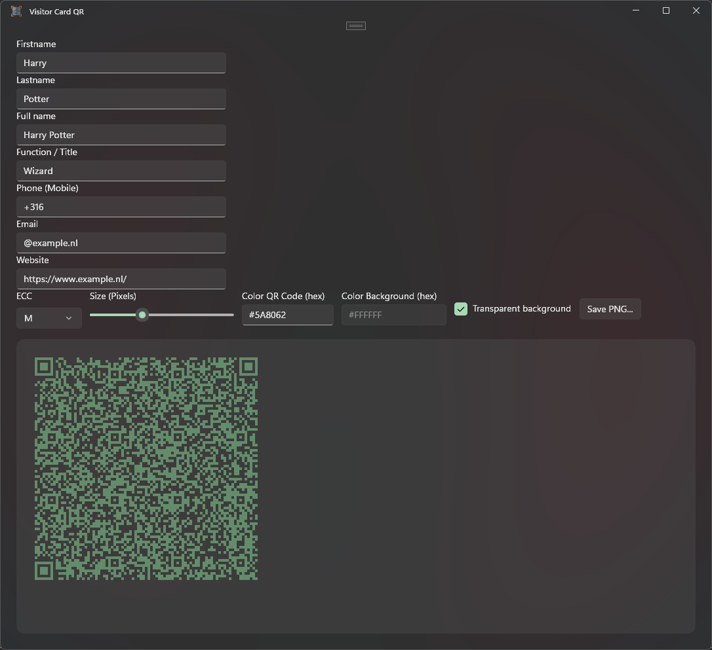
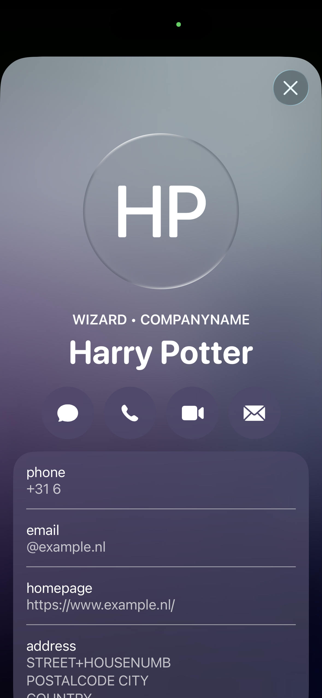

# Visitor Card QR
With this application we can create and also export the QR code. Makes it easy to add business people to someones phone as contact. I created this app for marketing and taught it be nice to share the code as well!

### Dependencies
- **[QRCoder]([https://github.com/ghost1372/DevWinUI](https://github.com/Shane32/QRCoder))**
- **[Windows Community Toolkit](https://github.com/CommunityToolkit/Windows)**
- **[Microsoft Windows SDK BuildTools](https://www.nuget.org/packages/Microsoft.Windows.SDK.BuildTools/10.0.26100.6584?_src=template)**
- **[Windows App SDK](https://github.com/microsoft/WindowsAppSDK)**
- **[WinUIEx](https://github.com/dotMorten/WinUIEx)**
